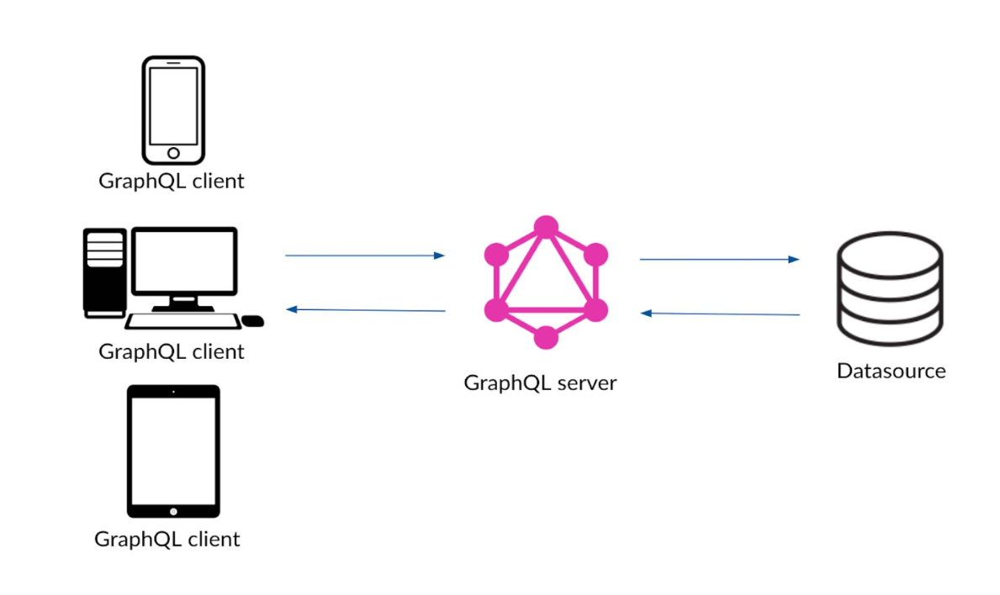

# VUE-GRAPHQL Project
[](graphql_image.jpg)

## About
This project was based on tutorial: 
[Node, Express, PostgreSQL, Vue 2 and GraphQL CRUD Web App](https://morioh.com/p/8a84a1678ad7/). Addtional
modifications were made from tutorial for configuration of project layout and structure.

## GraphQL Video
See [How to GraphQL](https://www.howtographql.com/basics/3-big-picture/).

## Project setup
```
The following tools, frameworks, and modules are required for this project:

Node.js (choose recommended version),
Vue 2,
Express.js,
GraphQL,
Express-GraphQL,
Vue-Apollo,
Bootstrap-Vue,
PostgreSQL,
Sequelize,
Terminal (Mac/Linux) or Node Command Line (Windows),
IDE or Text Editor (We are using Visual Studio Code)
```

### Project Context
```
Backend folder contains all configuration for GraphQL and PostgreSQL utilzing Sequelize 
as the ORM (Object Relational Model). Refer to README.md for 'backend' installation and configuation.

Client folder contains Vue.js components used to perform GraphQL CRUD operations. In addtion contains 
configuration for ApolloClient module used communicate and execute GraphQL operations. 
Refer to README.md for 'client' installtion and configuation.
```

### Customize GraphQL configuration
See [Configuration Reference](https://graphql.org/).

